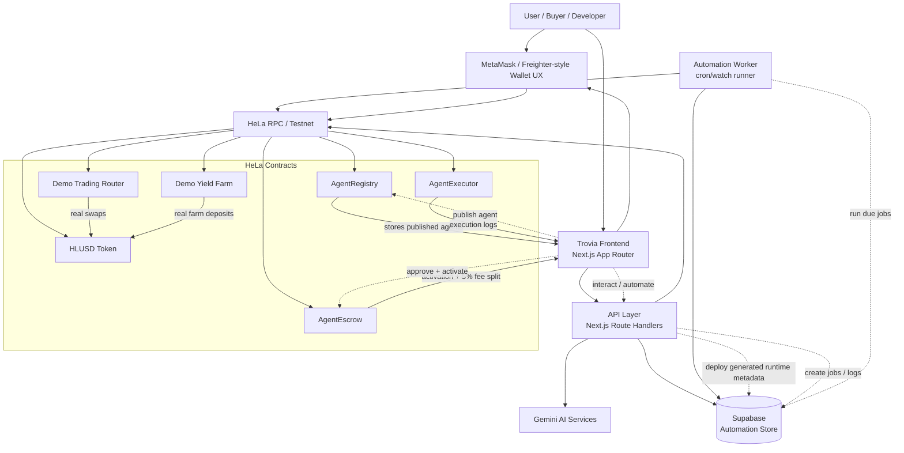

# System Design Diagram



## Component Summary

- `Frontend`: Trovia marketplace, publish flow, agent detail pages, dashboard, automation controls.
- `API Layer`: agent generation, review, deploy, interaction, automation job management, funding helpers.
- `Gemini`: drafts schemas/workflows for non-technical publishing and powers AI-driven agent behavior.
- `Supabase`: stores deployed agent metadata, automation jobs, and execution logs.
- `Automation Worker`: executes due jobs and updates job/log state.
- `HeLa Contracts`:
  - `AgentRegistry`: publishes and reads marketplace agents
  - `AgentEscrow`: handles activation payments and 5% platform fee split
  - `AgentExecutor`: stores on-chain execution log events
  - `Demo Trading Router`: executes whitelisted demo swaps
  - `Demo Yield Farm`: accepts demo HLUSD farming deposits
  - `HLUSD Token`: activation and execution settlement token

## Core Flows

### 1. Publish Flow

`Developer -> Frontend -> Gemini/API -> AgentRegistry`

- Developer describes or defines an agent.
- Gemini/API prepares schema and runtime metadata.
- Wallet signs and publishes the agent on HeLa.

### 2. Activation Flow

`Buyer -> Frontend -> Wallet -> AgentEscrow`

- Buyer configures an agent.
- Buyer approves HLUSD.
- `AgentEscrow` activates the agent and splits payment:
  - `95%` to developer
  - `5%` to Trovia

### 3. Automation Flow

`Frontend/API -> Supabase -> Worker -> HeLa`

- User creates an automation job.
- Job and wallet metadata are stored in Supabase.
- Worker picks up due jobs and executes:
  - scheduling transfers
  - trading swaps
  - rebalancing swaps
  - farming deposits
  - content/business automation runs

### 4. Dashboard Flow

`Supabase + HeLa events -> API -> Frontend`

- Dashboard shows active agents, published agents, job readiness, funding state, and execution logs.
```
